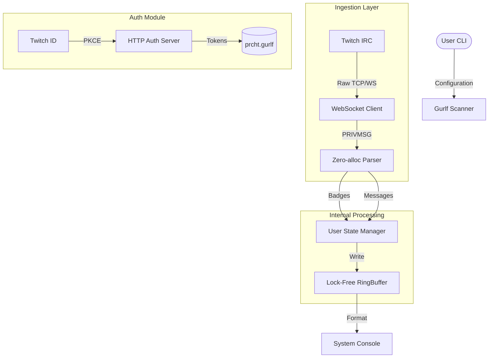

# ⚡ PrettyChat

<p align="center">
  <a href="https://go.dev"></a>
  
  
  
  
</p>

**PrettyChat** is a high-performance, console-based Twitch IRC aggregator. It is designed for maximum throughput, handling real-time chat streams with zero-allocation parsing logic and lock-free concurrency. It focuses purely on data ingestion, extraction, and internal state management, providing a robust backend engine for chat analytics and monitoring.

## ✨ Key Features

* **Zero-Allocation Hotpath**: Utilizes `unsafe.String` conversions and pre-allocated byte slices to extract nicknames, badges, and messages directly from raw `PRIVMSG` frames without garbage collection pressure.
* **Lock-Free Pipeline**: Implements a generic, thread-safe `RingBuffer[T]` using `sync/atomic` primitives, ensuring non-blocking data flow between socket ingestion and internal processing.
* **Integrated OAuth2 Flow**: Includes a native HTTP `authserver` that implements PKCE (Proof Key for Code Exchange) to securely perform code-to-token exchanges, storing configurations automatically via the **Gurlf** format.
* **Dynamic State Management**: Maintains active user tracking (nicks, badges, message history) in high-speed maps, supporting efficient querying and real-time state updates.
* **Gurlf Configuration Engine**: Powered by `Votline/Gurlf`, enabling flexible, memory-efficient configuration loading from both files and runtime-injected inline strings.

## 🏗 Architecture & Data Flow

Prcht functions as a highly decoupled event loop. The WebSocket reader handles low-level I/O, passing messages through a zero-allocation parser before piping them into atomic ring buffers.



## ⚙️ Configuration & Formats

Prcht utilizes the **Gurlf** configuration language for clean, schema-based credential management.

### Structure Sample (`prcht.gurlf`)

```ini
[PrettyChatConfig]
PASS:oauth:your_token_here
NICK:your_twitch_username
JOIN:channel_name
[\PrettyChatConfig]
```

## 🚀 Usage Guide

Prcht supports multiple launch vectors depending on your setup.

```bash
# Way 1: Parse from config file
prcht ./prcht.gurlf [args]

# Way 2: Inline string injection
prcht "[PrettyChatConfig]PASS:123...[\PrettyChatConfig]" -j=channelname

# Way 3: Direct arguments
prcht <PASS> <NICK> <JOIN>
```

### Flags & Reference

| Flag | Description |
| :--- | :--- |
| `-d` / `debug` | Enables verbose `Zap` logging for internal pipeline debugging. |
| `-a` / `auth` | Starts the local HTTP server for OAuth2 code/token exchange. |
| `-j=` | Dynamically overrides the `JOIN` target channel at runtime. |

## 📜 Licenses & Dependencies

The project leverages high-performance libraries for networking, structured logging, and lexical parsing.

| Dependency | License | Purpose | Reference |
| :--- | :--- | :--- | :--- |
| **Gorilla WebSocket** | BSD-2-Clause | Full-duplex WebSocket communication with Twitch IRC. | [gorilla/websocket](https://github.com/gorilla/websocket) |
| **Uber Zap** | MIT | High-performance, structured logging system. | [uber-go/zap](https://github.com/uber-go/zap) |
| **Gurlf** | MIT | High-speed, allocation-free configuration lexical parser. | [Votline/Gurlf](https://github.com/Votline/Gurlf) |

  - **License:** This project is licensed under [MIT](LICENSE)
